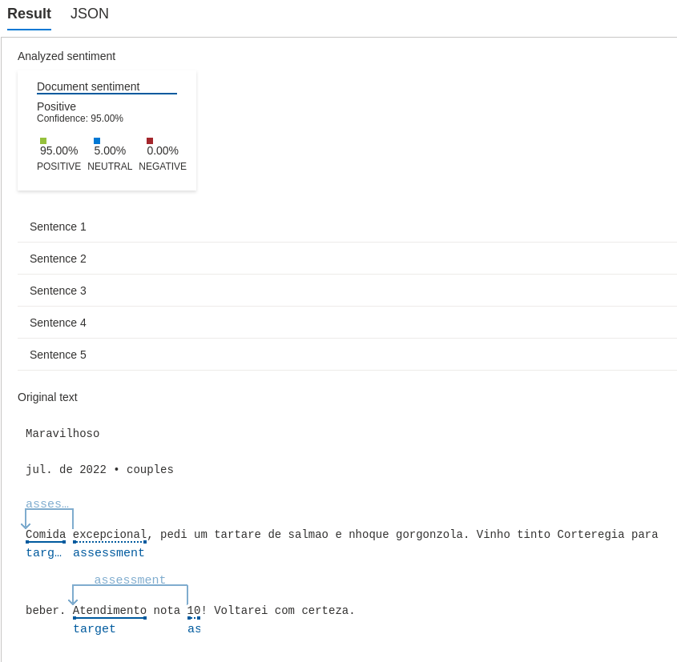
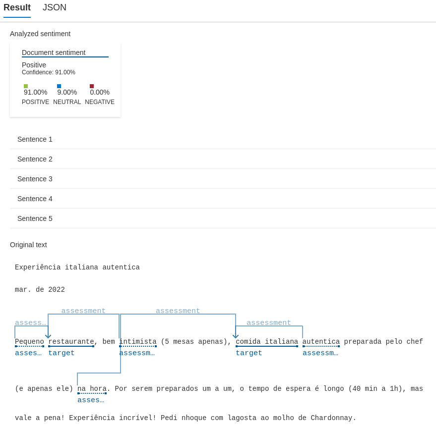
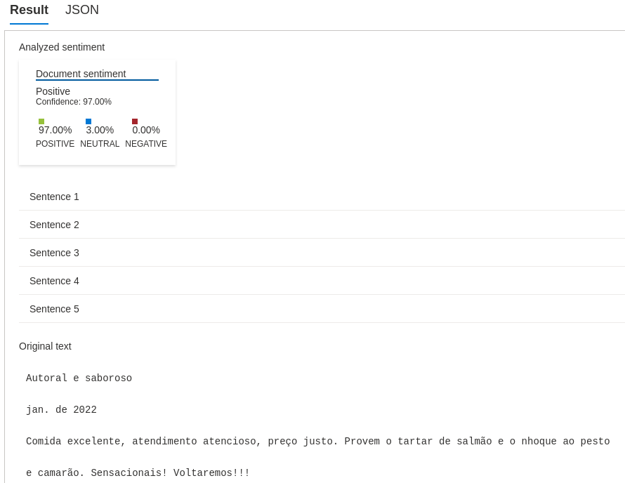
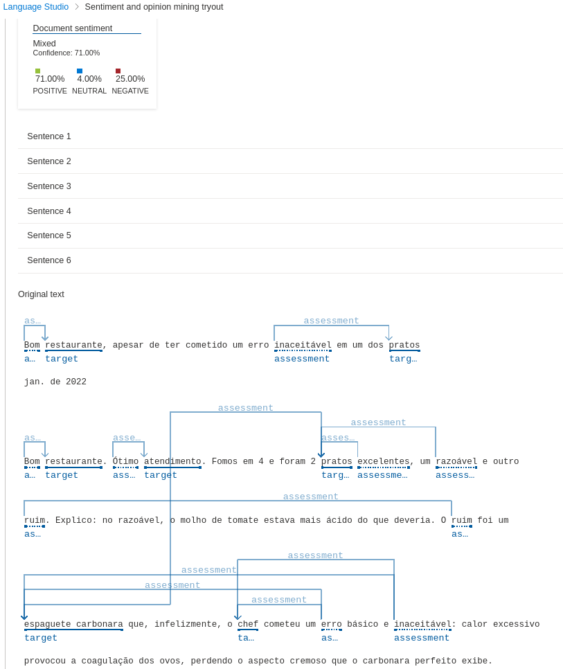

# dio-lab-analise-sentimentos
Resultado do laboratorio de analise de sentimento atraves de alguns exemplos.

## Descricao
Foi utilizado algumas opinioes retirada de um restaurante.
Nesse teste  uma empresa coleta opinioes que podem mudar a forma de abordagem, melhorando o atendimento ou mesmo reforcando o que de melhor foi realizado.

O sistema Analyze sentiment and opinions da Azure recebe cada opiniao, processa e retorna o texto dividio em sentencas, onde cada sentenca tem uma tabela chamada "Sentence sentiment" que indica a porcentagem de cada sentimento sendo eles: positivo, neutro e negativo. No inicio da analise ele ja exibe uma tabela de conclusao da analise de todas as sentencas. Caso o usuario queira saber uma informacao mais detalhada de cada sentenca, pode-se clicar na sentanca e verificar qual avaliacao foi dada para cada uma delas.

## Resultados
### Primeira opiniao

